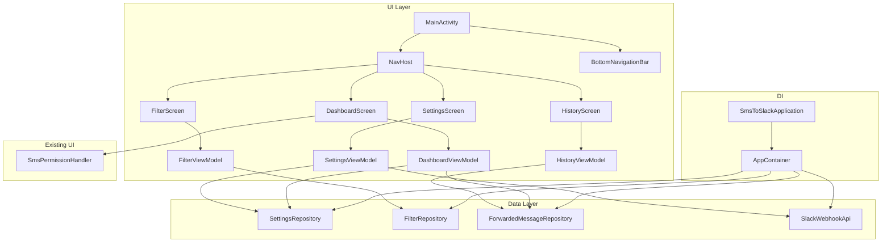
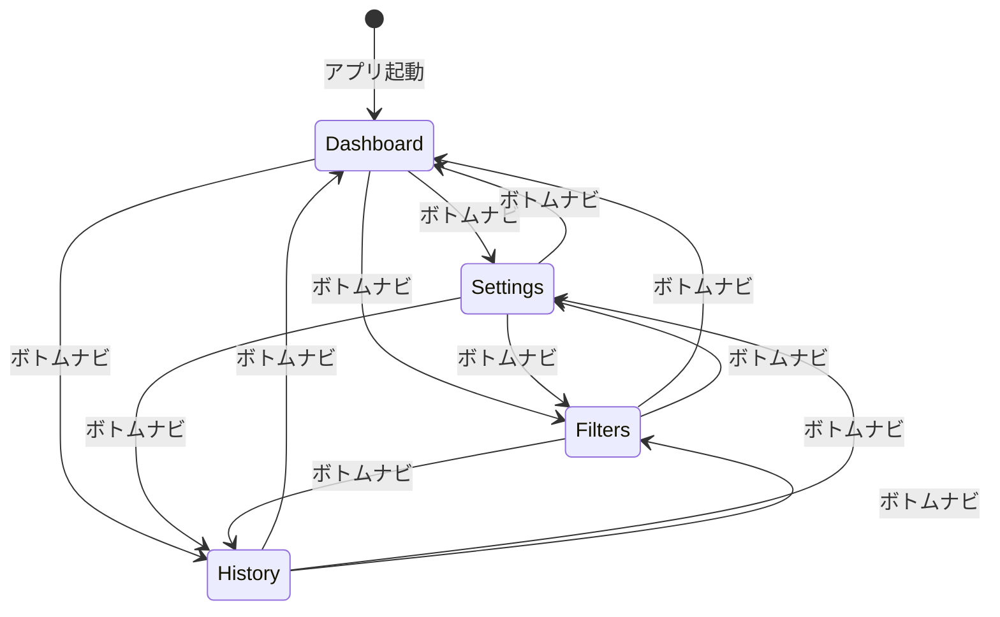
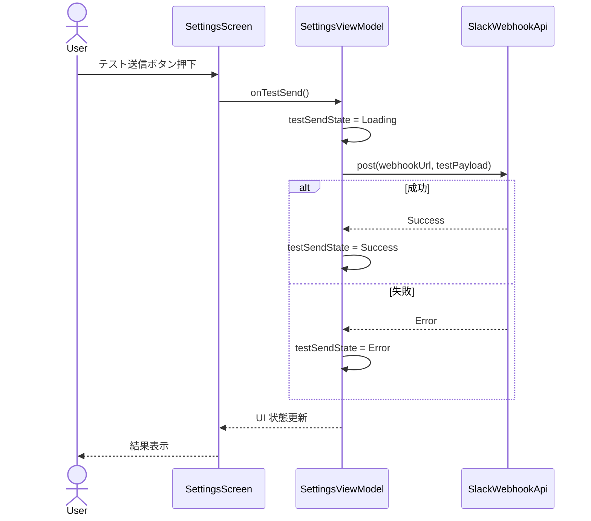

# Design Document: app-ui

## Overview

**Purpose**: SMS-to-Slack アプリの全画面 UI を提供し、ユーザーが転送状態の確認、Webhook 設定、フィルタ管理、転送履歴の閲覧を行えるようにする。

**Users**: SMS を Slack に転送したい Android ユーザーが、4つの画面（ダッシュボード、設定、フィルタ管理、転送履歴）を通じてアプリを操作する。

**Impact**: 現在のプレースホルダー MainActivity を完全な UI アプリケーションに置き換え、既存の Data Layer / Domain Layer を ViewModel 経由で接続する。

### Goals
- 4画面（ダッシュボード、設定、フィルタ管理、転送履歴）を Navigation Compose で提供する
- 既存リポジトリ群を手動 DI（AppContainer）経由で ViewModel に注入する
- SMS パーミッション要求フローをダッシュボードに統合する
- Material 3 のデザインガイドラインに準拠する

### Non-Goals
- プッシュ通知や通知チャンネルの実装
- 多言語対応（i18n）
- ダークテーマのカスタム配色（Material 3 Dynamic Color に委任）
- Hilt 等の DI フレームワーク導入

## Architecture

### Existing Architecture Analysis

既存の Data Layer と Domain Layer が完成済み:
- **SettingsRepository**: Webhook URL、転送有効/無効、フィルタモードの永続化（DataStore）
- **FilterRepository**: フィルタルールの CRUD（Room）
- **ForwardedMessageRepository**: 転送履歴の保存・取得（Room）
- **SmsPermissionHandler**: SMS パーミッション要求 UI（Compose）
- **SlackWebhookApi**: Slack Webhook への HTTP POST

UI Layer は未実装（MainActivity がプレースホルダー状態）。

### Architecture Pattern & Boundary Map



**Architecture Integration**:
- **Selected pattern**: MVVM + Repository（既存パターンを踏襲）
- **Domain boundaries**: Screen ごとに ViewModel を分離。ViewModel は Repository のみに依存
- **Existing patterns preserved**: StateFlow + collectAsState、Repository パターン、手動 DI
- **New components**: AppContainer、Application、4 ViewModel、4 Screen、NavHost、BottomNavigation
- **Steering compliance**: 依存方向 UI → Domain → Data を遵守。ViewModel は Android フレームワーク非依存（AndroidViewModel 不使用）

### Technology Stack

| Layer | Choice / Version | Role in Feature | Notes |
|-------|------------------|-----------------|-------|
| UI Framework | Jetpack Compose (BOM 2024.09.00) | 全画面の宣言的 UI | 既存 |
| Design System | Material 3 | BottomNavigation, Card, Dialog 等 | 既存 |
| Navigation | Navigation Compose 2.8.5 | 4画面間のナビゲーション | 新規追加 |
| ViewModel | lifecycle-viewmodel-compose 2.6.1 | Compose での ViewModel 統合 | 新規追加 |
| State | StateFlow + collectAsState | UI 状態管理 | 既存パターン |
| DI | 手動 AppContainer | リポジトリのシングルトン管理 | 新規追加 |

## System Flows

### ナビゲーションフロー



ボトムナビゲーションによるフラットな遷移。各画面は同一階層でスタックは不要。

### テスト送信フロー



## Requirements Traceability

| Requirement | Summary | Components | Contracts |
|-------------|---------|------------|-----------|
| 1.1 | Navigation Compose で4画面ナビゲーション | NavHost, Screen Route | State |
| 1.2 | ダッシュボードを初期表示 | NavHost | State |
| 1.3 | ボトムナビゲーションバー | BottomNavigationBar | State |
| 1.4 | 戻るボタンでナビゲーションスタック | NavHost | State |
| 2.1 | 転送トグル表示 | DashboardScreen, DashboardViewModel | State, Service |
| 2.2 | 転送トグル保存 | DashboardViewModel | Service |
| 2.3 | フィルタモード表示 | DashboardScreen, DashboardViewModel | State |
| 2.4 | Webhook URL 設定状態表示 | DashboardScreen, DashboardViewModel | State |
| 2.5 | 直近メッセージプレビュー | DashboardScreen, DashboardViewModel | State |
| 3.1 | Webhook URL テキストフィールド | SettingsScreen, SettingsViewModel | State |
| 3.2 | URL バリデーション表示 | SettingsScreen, SettingsViewModel | Service |
| 3.3 | 有効 URL の保存 | SettingsViewModel | Service |
| 3.4 | 無効 URL のエラー表示 | SettingsScreen, SettingsViewModel | State |
| 3.5 | フィルタモード選択 UI | SettingsScreen, SettingsViewModel | State |
| 3.6 | フィルタモード保存 | SettingsViewModel | Service |
| 3.7 | テスト送信ボタン | SettingsScreen, SettingsViewModel | State |
| 3.8 | テスト送信実行・結果表示 | SettingsViewModel, SlackWebhookApi | Service |
| 4.1 | フィルタルール一覧 | FilterScreen, FilterViewModel | State |
| 4.2 | ルール詳細表示 | FilterScreen | State |
| 4.3 | ルール追加ダイアログ | FilterScreen, FilterViewModel | State |
| 4.4 | ルール保存・リスト反映 | FilterViewModel | Service |
| 4.5 | 空パターンのエラー表示 | FilterScreen, FilterViewModel | State |
| 4.6 | ルール有効/無効トグル | FilterScreen, FilterViewModel | Service |
| 4.7 | ルール削除（確認付き） | FilterScreen, FilterViewModel | Service |
| 4.8 | 空状態メッセージ | FilterScreen | State |
| 5.1 | 転送履歴一覧（新しい順） | HistoryScreen, HistoryViewModel | State |
| 5.2 | メッセージ詳細表示 | HistoryScreen | State |
| 5.3 | ステータス色分け | HistoryScreen | State |
| 5.4 | 空状態メッセージ | HistoryScreen | State |
| 6.1 | 初回パーミッション要求 | SmsPermissionHandler, DashboardScreen | State |
| 6.2 | 拒否時の説明ダイアログ | SmsPermissionHandler | State |
| 6.3 | 永続拒否時の設定誘導 | SmsPermissionHandler | State |
| 6.4 | パーミッション警告バナー | SmsPermissionHandler, DashboardScreen | State |
| 7.1 | AppContainer の初期化 | SmsToSlackApplication, AppContainer | State |
| 7.2 | リポジトリのシングルトン提供 | AppContainer | Service |
| 7.3 | ViewModel がリポジトリを取得 | 各 ViewModel | Service |

## Components and Interfaces

| Component | Domain/Layer | Intent | Req Coverage | Key Dependencies | Contracts |
|-----------|-------------|--------|-------------|-----------------|-----------|
| SmsToSlackApplication | DI | Application クラスで AppContainer 初期化 | 7.1 | AppContainer (P0) | State |
| AppContainer | DI | リポジトリのシングルトン管理 | 7.2, 7.3 | AppDatabase (P0), SettingsDataStore (P0) | Service |
| Screen Route | Navigation | ナビゲーションルート定義 | 1.1, 1.2 | — | State |
| MainScreen | Navigation | NavHost + BottomNavigation のホスト | 1.1, 1.2, 1.3, 1.4 | NavController (P0) | State |
| DashboardViewModel | UI/ViewModel | ダッシュボード状態管理 | 2.1, 2.2, 2.3, 2.4, 2.5 | SettingsRepository (P0), ForwardedMessageRepository (P1) | Service, State |
| DashboardScreen | UI/Screen | ダッシュボード画面表示 | 2.1, 2.2, 2.3, 2.4, 2.5, 6.1, 6.2, 6.3, 6.4 | DashboardViewModel (P0), SmsPermissionHandler (P0) | State |
| SettingsViewModel | UI/ViewModel | 設定状態管理・テスト送信 | 3.1, 3.2, 3.3, 3.4, 3.5, 3.6, 3.7, 3.8 | SettingsRepository (P0), SlackWebhookApi (P1) | Service, State |
| SettingsScreen | UI/Screen | 設定画面表示 | 3.1, 3.2, 3.3, 3.4, 3.5, 3.6, 3.7, 3.8 | SettingsViewModel (P0) | State |
| FilterViewModel | UI/ViewModel | フィルタルール CRUD | 4.1, 4.2, 4.3, 4.4, 4.5, 4.6, 4.7, 4.8 | FilterRepository (P0) | Service, State |
| FilterScreen | UI/Screen | フィルタ管理画面表示 | 4.1, 4.2, 4.3, 4.4, 4.5, 4.6, 4.7, 4.8 | FilterViewModel (P0) | State |
| HistoryViewModel | UI/ViewModel | 転送履歴状態管理 | 5.1, 5.2, 5.3, 5.4 | ForwardedMessageRepository (P0) | State |
| HistoryScreen | UI/Screen | 転送履歴画面表示 | 5.1, 5.2, 5.3, 5.4 | HistoryViewModel (P0) | State |

### DI Layer

#### SmsToSlackApplication

| Field | Detail |
|-------|--------|
| Intent | Application クラスとして AppContainer を初期化・保持する |
| Requirements | 7.1 |

**Responsibilities & Constraints**
- Application.onCreate() で AppContainer をインスタンス化する
- AndroidManifest.xml に android:name 属性を登録する

**Contracts**: State [x]

##### State Management
- **State model**: `lateinit var appContainer: AppContainer`
- **Persistence**: Application ライフサイクルと一致（プロセス存続中は維持）

#### AppContainer

| Field | Detail |
|-------|--------|
| Intent | 全リポジトリと API クライアントのシングルトンインスタンスを提供する |
| Requirements | 7.2, 7.3 |

**Responsibilities & Constraints**
- AppDatabase、SettingsDataStore のインスタンスを生成する
- SettingsRepository、FilterRepository、ForwardedMessageRepository、SlackWebhookApi を lazy 初期化で提供する
- ViewModel の Factory メソッドを提供する

**Dependencies**
- Outbound: AppDatabase — Room DB インスタンス (P0)
- Outbound: SettingsDataStore — DataStore インスタンス (P0)

**Contracts**: Service [x]

##### Service Interface
```kotlin
class AppContainer(context: Context) {
    val settingsRepository: SettingsRepository
    val filterRepository: FilterRepository
    val forwardedMessageRepository: ForwardedMessageRepository
    val slackWebhookApi: SlackWebhookApi
}
```

### Navigation Layer

#### Screen Route

| Field | Detail |
|-------|--------|
| Intent | ナビゲーションルートを文字列定数として定義する |
| Requirements | 1.1, 1.2 |

**Contracts**: State [x]

##### State Management
```kotlin
object Route {
    const val DASHBOARD: String
    const val SETTINGS: String
    const val FILTERS: String
    const val HISTORY: String
}
```

#### MainScreen

| Field | Detail |
|-------|--------|
| Intent | NavHost と BottomNavigationBar を組み合わせた画面ルートホスト |
| Requirements | 1.1, 1.2, 1.3, 1.4 |

**Responsibilities & Constraints**
- Scaffold 内に BottomNavigationBar と NavHost を配置する
- NavController で各画面のナビゲーション状態を管理する
- 現在のルートに応じてボトムナビのアイテムをハイライトする

**Dependencies**
- Inbound: MainActivity — setContent で呼び出し (P0)
- Outbound: NavController — ナビゲーション状態 (P0)
- Outbound: 各 Screen Composable — 画面表示 (P0)

**Contracts**: State [x]

##### State Management
- **State model**: NavController が現在のルートを管理
- **BottomNavigation items**: Dashboard (アイコン: Home), Settings (アイコン: Settings), Filters (アイコン: FilterList), History (アイコン: History)

### UI/ViewModel Layer

#### DashboardViewModel

| Field | Detail |
|-------|--------|
| Intent | ダッシュボード画面の状態管理と転送トグル操作 |
| Requirements | 2.1, 2.2, 2.3, 2.4, 2.5 |

**Dependencies**
- Outbound: SettingsRepository — 転送設定・フィルタモード取得 (P0)
- Outbound: ForwardedMessageRepository — 直近メッセージ取得 (P1)

**Contracts**: Service [x] / State [x]

##### Service Interface
```kotlin
class DashboardViewModel(
    settingsRepository: SettingsRepository,
    forwardedMessageRepository: ForwardedMessageRepository
) : ViewModel() {
    fun toggleForwarding(enabled: Boolean)
}
```

##### State Management
```kotlin
data class DashboardUiState(
    val forwardingEnabled: Boolean,
    val filterMode: FilterMode,
    val webhookConfigured: Boolean,
    val recentMessages: List<ForwardedMessageEntity>
)
```
- **Persistence**: StateFlow で UI に公開。Repository の Flow を combine して生成
- **Concurrency**: viewModelScope で coroutine 起動

#### SettingsViewModel

| Field | Detail |
|-------|--------|
| Intent | 設定画面の状態管理・URL バリデーション・テスト送信 |
| Requirements | 3.1, 3.2, 3.3, 3.4, 3.5, 3.6, 3.7, 3.8 |

**Dependencies**
- Outbound: SettingsRepository — Webhook URL・フィルタモード読み書き (P0)
- Outbound: SlackWebhookApi — テスト送信 (P1)

**Contracts**: Service [x] / State [x]

##### Service Interface
```kotlin
class SettingsViewModel(
    settingsRepository: SettingsRepository,
    slackWebhookApi: SlackWebhookApi
) : ViewModel() {
    fun updateWebhookUrl(url: String)
    fun saveWebhookUrl()
    fun updateFilterMode(mode: FilterMode)
    fun sendTestMessage()
}
```

##### State Management
```kotlin
data class SettingsUiState(
    val webhookUrl: String,
    val isWebhookUrlValid: Boolean,
    val filterMode: FilterMode,
    val testSendStatus: TestSendStatus
)

enum class TestSendStatus {
    IDLE, SENDING, SUCCESS, FAILED
}
```
- **Persistence**: Webhook URL は入力中の値（ローカル）と保存済み値（DataStore）を分離
- **Concurrency**: テスト送信は Dispatchers.IO で実行

#### FilterViewModel

| Field | Detail |
|-------|--------|
| Intent | フィルタルールの CRUD 操作と一覧状態管理 |
| Requirements | 4.1, 4.2, 4.3, 4.4, 4.5, 4.6, 4.7, 4.8 |

**Dependencies**
- Outbound: FilterRepository — ルール CRUD (P0)

**Contracts**: Service [x] / State [x]

##### Service Interface
```kotlin
class FilterViewModel(
    filterRepository: FilterRepository
) : ViewModel() {
    fun addRule(type: FilterRuleType, pattern: String)
    fun deleteRule(id: Long)
    fun toggleRuleEnabled(id: Long, enabled: Boolean)
}
```

##### State Management
```kotlin
data class FilterUiState(
    val rules: List<FilterRuleEntity>,
    val showAddDialog: Boolean,
    val showDeleteConfirmation: Long?
)
```
- **Persistence**: FilterRepository.allRulesFlow を stateIn で変換
- **Concurrency**: CRUD 操作は viewModelScope で実行

#### HistoryViewModel

| Field | Detail |
|-------|--------|
| Intent | 転送履歴の一覧状態管理 |
| Requirements | 5.1, 5.2, 5.3, 5.4 |

**Dependencies**
- Outbound: ForwardedMessageRepository — 転送履歴取得 (P0)

**Contracts**: State [x]

##### State Management
```kotlin
data class HistoryUiState(
    val messages: List<ForwardedMessageEntity>
)
```
- **Persistence**: ForwardedMessageRepository.getRecentMessages() を stateIn で変換

### UI/Screen Layer

各 Screen コンポーネントはプレゼンテーション層であり、新しいバウンダリを導入しない。ViewModel から StateFlow を collectAsState で購読し、ユーザーイベントを ViewModel のメソッドに委譲する。

**Implementation Notes**:
- **DashboardScreen**: SmsPermissionHandler でラップし、パーミッション警告バナーを統合。転送トグル、フィルタモード、Webhook 状態、直近メッセージを Card コンポーネントで表示
- **SettingsScreen**: OutlinedTextField で Webhook URL 入力。SegmentedButton または RadioButton でフィルタモード選択。テスト送信ボタンに CircularProgressIndicator
- **FilterScreen**: LazyColumn でルール一覧。FAB でルール追加ダイアログ。SwipeToDismiss または長押しで削除。Switch でルール有効/無効トグル。空状態では Column + Text + Icon
- **HistoryScreen**: LazyColumn でメッセージ一覧。ステータスごとの色分け: SUCCESS=Green, FAILED=Red, FILTERED=Yellow。空状態では Column + Text + Icon

## Data Models

### Domain Model

既存モデルをそのまま使用。新規モデルは UI 状態のみ:

- **DashboardUiState**: 転送有効/無効、フィルタモード、Webhook 設定状態、直近メッセージ
- **SettingsUiState**: Webhook URL、バリデーション結果、フィルタモード、テスト送信状態
- **FilterUiState**: ルール一覧、ダイアログ表示状態
- **HistoryUiState**: メッセージ一覧

新しい永続化モデルは不要。全データは既存の DataStore / Room で管理済み。

## Error Handling

### Error Strategy
- **Webhook URL バリデーション**: SettingsRepository.isValidWebhookUrl() でリアルタイム検証。無効時はエラーテキスト表示
- **テスト送信失敗**: SlackPostResult のエラー種別に応じたメッセージを Snackbar で表示
- **フィルタルール空パターン**: ダイアログの確定ボタンを無効化 + エラーテキスト表示
- **リポジトリ例外**: ViewModel で try-catch し、UI に適切なエラー状態を伝播

## Testing Strategy

### Unit Tests
- DashboardViewModel: 転送トグル切替で SettingsRepository.saveForwardingEnabled が呼ばれること
- SettingsViewModel: URL バリデーション結果が UiState に反映されること
- SettingsViewModel: テスト送信で SlackWebhookApi.post が呼ばれ結果が UiState に反映されること
- FilterViewModel: ルール追加・削除・トグルが FilterRepository に委譲されること

### UI Tests
- ダッシュボード画面: 転送トグル表示・フィルタモード表示の確認
- 設定画面: Webhook URL 入力・バリデーションエラー表示の確認
- フィルタ画面: ルール一覧表示・追加ダイアログ・空状態の確認
- 履歴画面: メッセージ一覧・ステータス色分け・空状態の確認
- ナビゲーション: ボトムナビで4画面間の遷移確認
