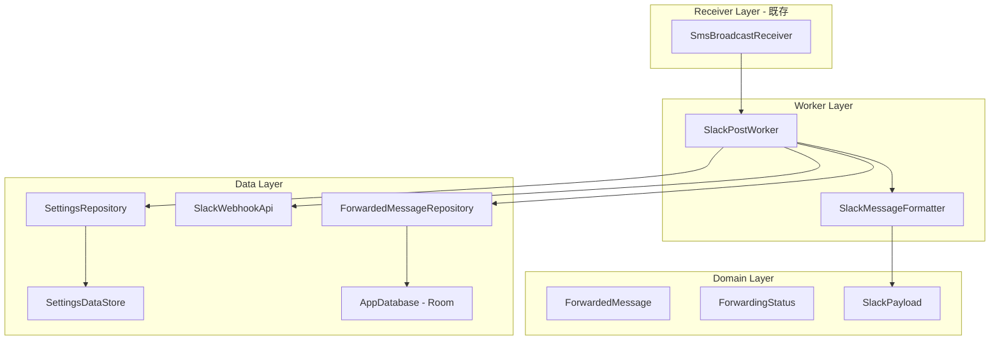
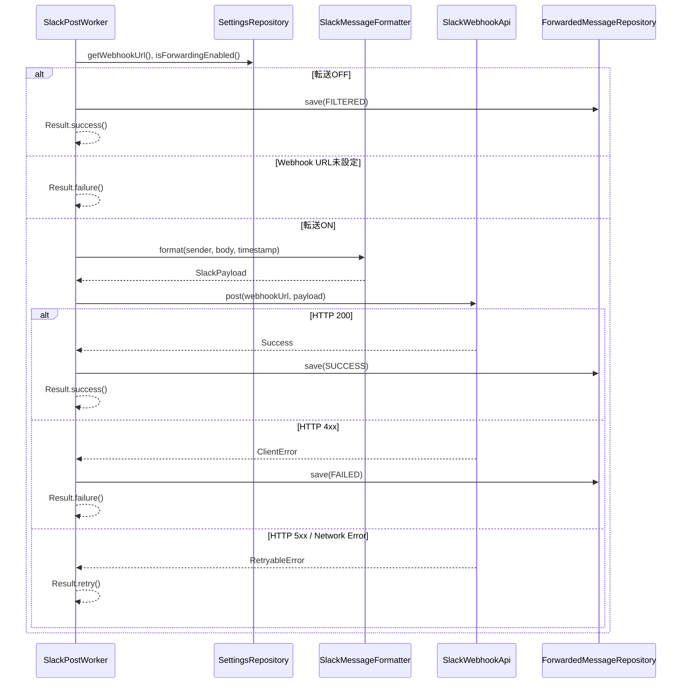
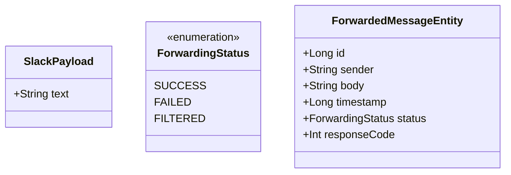

# Design Document: slack-integration

## Overview
**Purpose**: 本機能は、sms-reception で受信・パースされた SMS メッセージを Slack Incoming Webhook に HTTP POST で投稿する。Webhook URL 設定の永続化、メッセージフォーマット変換、WorkManager による信頼性のあるバックグラウンド投稿、転送履歴の記録を提供する。

**Users**: 全ユーザーが SMS 転送の恩恵を受ける。設定画面で Webhook URL を入力し、転送の有効/無効を制御する。

**Impact**: 既存の SlackPostWorker（スタブ）を本実装に置き換え、新規コンポーネント（SlackWebhookApi、SlackMessageFormatter、SettingsDataStore、SettingsRepository、ForwardedMessageRepository、Room DB）を追加する。

### Goals
- SMS メッセージを Slack mrkdwn 形式にフォーマットし Incoming Webhook に投稿する
- Webhook URL と転送フラグを DataStore で永続化する
- WorkManager の指数バックオフリトライでネットワーク不安定時も確実に投稿する
- 転送結果を Room DB に記録し履歴として閲覧可能にする

### Non-Goals
- Slack Web API（Bot Token）による投稿
- Block Kit による高度なメッセージレイアウト（MVP では text フィールドのみ）
- SMSフィルタリングロジック（別 spec: sms-filtering）
- 設定画面・履歴画面の UI 実装（別 spec: app-ui）

## Architecture

### Architecture Pattern & Boundary Map



**Architecture Integration**:
- **Selected pattern**: MVVM + Repository。steering tech.md に準拠
- **Existing patterns preserved**: SmsBroadcastReceiver → SlackPostWorker のパイプラインを維持。SlackPostWorker のスタブを本実装に置き換え
- **New components rationale**: SlackWebhookApi（HTTP通信の責務分離）、SlackMessageFormatter（フォーマット変換の純粋関数化）、SettingsDataStore/Repository（設定管理）、ForwardedMessageRepository + Room（転送履歴）
- **Steering compliance**: Data 層に Repository パターン、Domain 層は Android 非依存

### Technology Stack

| Layer | Choice / Version | Role in Feature | Notes |
|-------|------------------|-----------------|-------|
| Data / HTTP | OkHttp 4.12.0 | Slack Webhook への HTTP POST | 同期呼び出し（CoroutineWorker 内） |
| Data / Storage | DataStore Preferences 1.1.x | Webhook URL、転送フラグの永続化 | Flow で変更監視 |
| Data / Storage | Room 2.6.x | 転送履歴の永続化 | KSP でアノテーション処理 |
| Data / Serialization | kotlinx-serialization 1.7.x | Slack ペイロード JSON 生成 | @Serializable data class |
| Worker | WorkManager 2.9.1 | バックグラウンド投稿、リトライ | 既に依存関係追加済み |

## System Flows

### SMS → Slack 投稿フロー



## Requirements Traceability

| Requirement | Summary | Components | Interfaces | Flows |
|-------------|---------|------------|------------|-------|
| 1.1 | Webhook URL を DataStore に永続化 | SettingsDataStore, SettingsRepository | saveWebhookUrl(), webhookUrlFlow | — |
| 1.2 | URL 入力時に即座に書き込み | SettingsRepository | saveWebhookUrl() | — |
| 1.3 | 再起動後に復元 | SettingsDataStore | webhookUrlFlow | — |
| 1.4 | Flow として公開 | SettingsRepository | webhookUrlFlow | — |
| 2.1 | 転送フラグを DataStore に永続化 | SettingsDataStore, SettingsRepository | saveForwardingEnabled() | — |
| 2.2 | 転送OFF時に投稿しない | SlackPostWorker | doWork() | SMS → Slack フロー |
| 2.3 | 転送ON時に投稿する | SlackPostWorker | doWork() | SMS → Slack フロー |
| 2.4 | デフォルト true | SettingsDataStore | FORWARDING_ENABLED key | — |
| 3.1 | SmsMessage を JSON ペイロードに変換 | SlackMessageFormatter | format() | SMS → Slack フロー |
| 3.2 | 送信元・日時・本文を含む | SlackMessageFormatter | format() | — |
| 3.3 | mrkdwn 記法で整形 | SlackMessageFormatter | format() | — |
| 4.1 | JSON POST リクエスト送信 | SlackWebhookApi | post() | SMS → Slack フロー |
| 4.2 | HTTP 200 で成功返却 | SlackWebhookApi | post() | — |
| 4.3 | HTTP 4xx でエラー返却 | SlackWebhookApi | post() | — |
| 4.4 | HTTP 5xx でリトライ可能返却 | SlackWebhookApi | post() | — |
| 4.5 | 30秒タイムアウト | SlackWebhookApi | OkHttpClient config | — |
| 5.1 | WorkManager enqueue | SmsBroadcastReceiver (既存) | — | — |
| 5.2 | ネットワーク制約 | SmsBroadcastReceiver (既存) | Constraints | — |
| 5.3 | リトライ（指数バックオフ） | SlackPostWorker | Result.retry() | SMS → Slack フロー |
| 5.4 | 成功時 Result.success() | SlackPostWorker | doWork() | — |
| 5.5 | 回復不能時 Result.failure() | SlackPostWorker | doWork() | — |
| 5.6 | 転送OFF時スキップ | SlackPostWorker | doWork() | SMS → Slack フロー |
| 6.1 | 処理完了時に Room に記録 | ForwardedMessageRepository, AppDatabase | save() | SMS → Slack フロー |
| 6.2 | Entity に必要フィールド含む | ForwardedMessageEntity | — | — |
| 6.3 | 新しい順に Flow で公開 | ForwardedMessageRepository | getRecentMessages() | — |
| 6.4 | 最大1000件で自動削除 | ForwardedMessageRepository | trimOldMessages() | — |
| 7.1 | テストメッセージ POST | SlackWebhookApi | post() | — |
| 7.2 | 成功メッセージ表示 | UI Layer (別 spec) | — | — |
| 7.3 | エラー詳細表示 | UI Layer (別 spec) | — | — |
| 7.4 | URL バリデーション | SettingsRepository | isValidWebhookUrl() | — |

## Components and Interfaces

| Component | Domain/Layer | Intent | Req Coverage | Key Dependencies | Contracts |
|-----------|-------------|--------|--------------|-----------------|-----------|
| SettingsDataStore | Data/Local | DataStore Preferences ラッパー | 1.1, 1.3, 2.1, 2.4 | DataStore (P0) | State |
| SettingsRepository | Data/Repository | 設定値の読み書き API | 1.1, 1.2, 1.3, 1.4, 2.1, 2.2, 2.3, 2.4, 7.4 | SettingsDataStore (P0) | Service |
| SlackMessageFormatter | Worker | SMS → Slack ペイロード変換 | 3.1, 3.2, 3.3 | なし | Service |
| SlackWebhookApi | Data/Remote | Slack Webhook HTTP POST | 4.1, 4.2, 4.3, 4.4, 4.5, 7.1 | OkHttp (P0) | Service |
| SlackPostWorker | Worker | バックグラウンド Slack 投稿 | 5.1, 5.2, 5.3, 5.4, 5.5, 5.6, 2.2, 2.3 | SettingsRepo (P0), SlackWebhookApi (P0), ForwardedMessageRepo (P1) | Service |
| ForwardedMessageEntity | Data/Local | 転送履歴の Room エンティティ | 6.2 | なし | State |
| ForwardedMessageDao | Data/Local | 転送履歴 CRUD | 6.1, 6.3, 6.4 | Room (P0) | Service |
| ForwardedMessageRepository | Data/Repository | 転送履歴の読み書き API | 6.1, 6.3, 6.4 | ForwardedMessageDao (P0) | Service |
| AppDatabase | Data/Local | Room データベース定義 | 6.1 | Room (P0) | — |
| SlackPayload | Domain/Model | Slack JSON ペイロードモデル | 3.1 | kotlinx-serialization (P0) | State |
| ForwardingStatus | Domain/Model | 転送結果の列挙型 | 6.2 | なし | State |

### Data Layer

#### SettingsDataStore

| Field | Detail |
|-------|--------|
| Intent | DataStore Preferences のラッパー。Webhook URL と転送フラグを永続化する |
| Requirements | 1.1, 1.3, 2.1, 2.4 |

**Responsibilities & Constraints**
- stringPreferencesKey("webhook_url") と booleanPreferencesKey("forwarding_enabled") を管理
- Flow<String?> と Flow<Boolean> で設定値を公開
- suspend 関数で設定値を書き込み

**Dependencies**
- External: DataStore Preferences — 永続化エンジン (P0)

**Contracts**: State [x]

##### State Management
```kotlin
class SettingsDataStore(private val dataStore: DataStore<Preferences>) {
    val webhookUrlFlow: Flow<String?>
    val forwardingEnabledFlow: Flow<Boolean>
    suspend fun saveWebhookUrl(url: String)
    suspend fun saveForwardingEnabled(enabled: Boolean)
}
```

#### SettingsRepository

| Field | Detail |
|-------|--------|
| Intent | 設定値へのアクセスを統一する Repository |
| Requirements | 1.1, 1.2, 1.3, 1.4, 2.1, 2.2, 2.3, 2.4, 7.4 |

**Contracts**: Service [x]

##### Service Interface
```kotlin
class SettingsRepository(private val dataStore: SettingsDataStore) {
    val webhookUrlFlow: Flow<String?>
    val forwardingEnabledFlow: Flow<Boolean>
    suspend fun saveWebhookUrl(url: String)
    suspend fun saveForwardingEnabled(enabled: Boolean)
    suspend fun getWebhookUrl(): String?
    suspend fun isForwardingEnabled(): Boolean
    fun isValidWebhookUrl(url: String): Boolean
}
```
- **Preconditions**: なし
- **Postconditions**: saveWebhookUrl 呼び出し後、webhookUrlFlow が新しい値を emit する
- **Invariants**: forwardingEnabled のデフォルト値は true

#### SlackWebhookApi

| Field | Detail |
|-------|--------|
| Intent | OkHttp で Slack Webhook に JSON POST する HTTP クライアント |
| Requirements | 4.1, 4.2, 4.3, 4.4, 4.5, 7.1 |

**Dependencies**
- External: OkHttp — HTTP クライアント (P0)
- External: Slack Incoming Webhook API — 投稿先 (P0)

**Contracts**: Service [x]

##### Service Interface
```kotlin
sealed class SlackPostResult {
    data object Success : SlackPostResult()
    data class ClientError(val code: Int, val message: String) : SlackPostResult()
    data class RetryableError(val code: Int?, val message: String) : SlackPostResult()
}

class SlackWebhookApi(private val client: OkHttpClient) {
    fun post(webhookUrl: String, payload: SlackPayload): SlackPostResult
}
```
- **Preconditions**: webhookUrl が空でない有効な URL
- **Postconditions**: HTTP レスポンスに基づく SlackPostResult を返す
- **Invariants**: タイムアウトは 30 秒

#### ForwardedMessageDao

| Field | Detail |
|-------|--------|
| Intent | 転送履歴の CRUD 操作 |
| Requirements | 6.1, 6.3, 6.4 |

**Contracts**: Service [x]

##### Service Interface
```kotlin
@Dao
interface ForwardedMessageDao {
    @Insert
    suspend fun insert(message: ForwardedMessageEntity)

    @Query("SELECT * FROM forwarded_messages ORDER BY timestamp DESC")
    fun getRecentMessages(): Flow<List<ForwardedMessageEntity>>

    @Query("DELETE FROM forwarded_messages WHERE id NOT IN (SELECT id FROM forwarded_messages ORDER BY timestamp DESC LIMIT 1000)")
    suspend fun trimOldMessages()
}
```

#### ForwardedMessageRepository

| Field | Detail |
|-------|--------|
| Intent | 転送履歴への統一アクセス |
| Requirements | 6.1, 6.3, 6.4 |

**Contracts**: Service [x]

##### Service Interface
```kotlin
class ForwardedMessageRepository(private val dao: ForwardedMessageDao) {
    fun getRecentMessages(): Flow<List<ForwardedMessageEntity>>
    suspend fun save(sender: String, body: String, timestamp: Long, status: ForwardingStatus, responseCode: Int?)
}
```

### Worker Layer

#### SlackMessageFormatter

| Field | Detail |
|-------|--------|
| Intent | SmsMessage データを Slack 用 JSON ペイロードに変換する |
| Requirements | 3.1, 3.2, 3.3 |

**Dependencies**
- なし（純粋関数）

**Contracts**: Service [x]

##### Service Interface
```kotlin
object SlackMessageFormatter {
    fun format(sender: String, body: String, timestamp: Long): SlackPayload
}
```
- **Preconditions**: sender が空でない
- **Postconditions**: Slack mrkdwn 形式のテキストを含む SlackPayload を返す

#### SlackPostWorker（既存スタブの本実装）

| Field | Detail |
|-------|--------|
| Intent | バックグラウンドで SMS を Slack に投稿し、結果を記録する |
| Requirements | 5.1, 5.2, 5.3, 5.4, 5.5, 5.6, 2.2, 2.3 |

**Dependencies**
- Inbound: SmsBroadcastReceiver — WorkManager enqueue (P0)
- Outbound: SettingsRepository — 設定値読み取り (P0)
- Outbound: SlackMessageFormatter — メッセージ変換 (P0)
- Outbound: SlackWebhookApi — HTTP POST (P0)
- Outbound: ForwardedMessageRepository — 履歴記録 (P1)

**Contracts**: Service [x]

##### Service Interface
```kotlin
class SlackPostWorker(context: Context, params: WorkerParameters) : CoroutineWorker(context, params) {
    override suspend fun doWork(): Result
}
```
- **Result.success()**: 投稿成功 or 転送OFF
- **Result.retry()**: リトライ可能なエラー（5xx、ネットワーク）
- **Result.failure()**: 回復不能エラー（4xx、URL未設定）

## Data Models

### Domain Model



- **SlackPayload**: Slack Webhook 用 JSON ペイロード。@Serializable。text フィールドに mrkdwn テキストを含む
- **ForwardingStatus**: 転送結果の列挙型（SUCCESS: 投稿成功、FAILED: 投稿失敗、FILTERED: フィルタ or 転送OFF でスキップ）
- **ForwardedMessageEntity**: Room エンティティ。autoGenerate の Long id を主キーとする

### Physical Data Model

**Room Database: AppDatabase**

```sql
CREATE TABLE forwarded_messages (
    id INTEGER PRIMARY KEY AUTOINCREMENT,
    sender TEXT NOT NULL,
    body TEXT NOT NULL,
    timestamp INTEGER NOT NULL,
    status TEXT NOT NULL,
    response_code INTEGER
);

CREATE INDEX idx_forwarded_messages_timestamp ON forwarded_messages(timestamp DESC);
```

## Error Handling

### Error Strategy
Slack 投稿の成功/失敗を3種類に分類し、WorkManager のリトライ機構と連携する。

### Error Categories and Responses
- **成功（HTTP 200）**: 転送履歴に SUCCESS を記録、Result.success()
- **クライアントエラー（HTTP 4xx）**: Webhook URL 無効等。リトライ不可。転送履歴に FAILED を記録、Result.failure()
- **サーバーエラー/ネットワーク（HTTP 5xx / IOException）**: リトライ可能。Result.retry() で WorkManager が指数バックオフで再実行
- **転送OFF / URL未設定**: 転送履歴に FILTERED を記録（転送OFF時）、Result.failure()（URL未設定時）

## Testing Strategy

### Unit Tests
- `SlackMessageFormatter.format()`: 各フィールドの正しい mrkdwn 変換を検証
- `SlackPayload`: JSON シリアライゼーション/デシリアライゼーションを検証
- `SettingsRepository.isValidWebhookUrl()`: 各種 URL パターンのバリデーション
- `ForwardingStatus`: 列挙値の網羅

### Integration Tests
- `SlackPostWorker.doWork()`: モック依存で転送ON/OFF、成功/失敗/リトライの各パスを検証
- `SettingsDataStore`: DataStore の読み書きと Flow 通知を検証
- `ForwardedMessageDao`: Room in-memory DB で CRUD と trimOldMessages を検証

## Security Considerations
- Webhook URL はセンシティブ情報。DataStore に平文保存（MVP）。将来的に EncryptedSharedPreferences 検討
- SMS 本文をログに記録しない
- OkHttp タイムアウト設定でリソース枯渇を防止
