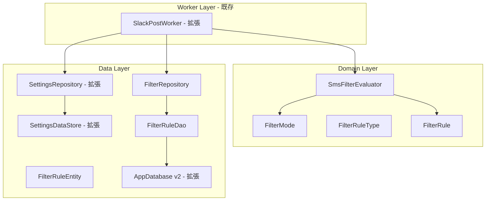
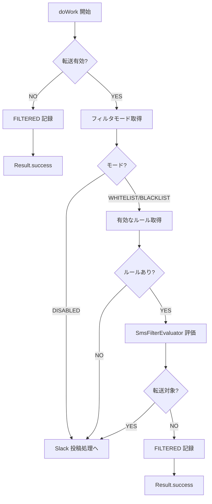
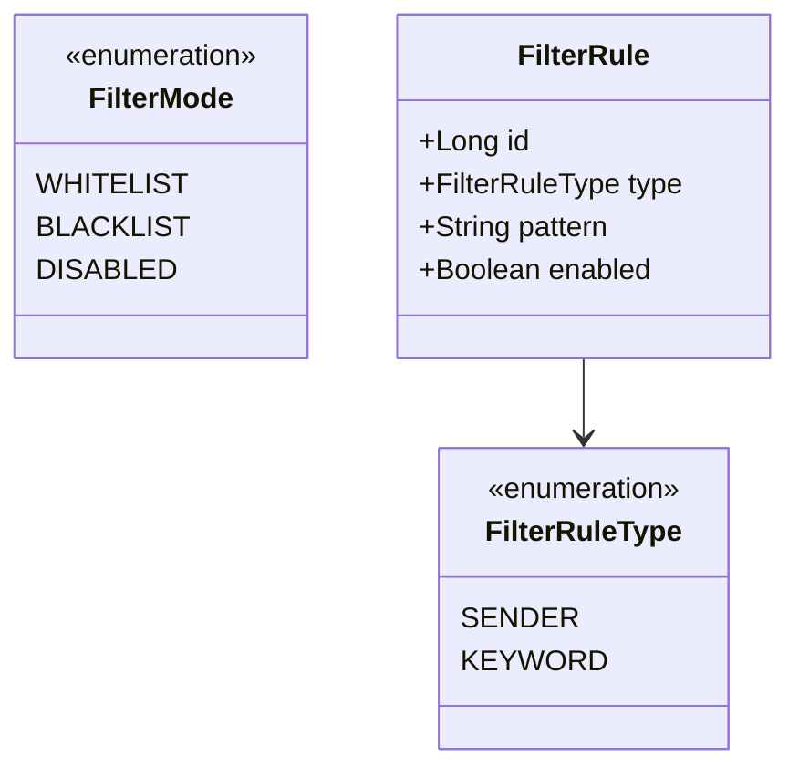

# Design Document: sms-filtering

## Overview
**Purpose**: 本機能は、受信 SMS の転送可否をユーザー定義のフィルタルールに基づいて判定する。送信元番号パターンとキーワードパターンによるホワイトリスト/ブラックリストフィルタリングを提供し、既存の SMS → Slack 転送パイプラインに統合する。

**Users**: 特定の送信元や内容の SMS だけを Slack に転送したいユーザー。

**Impact**: 既存の SlackPostWorker にフィルタ評価ステップを追加し、SettingsDataStore/Repository にフィルタモード設定を拡張、AppDatabase に FilterRuleEntity を追加する。

### Goals
- 送信元番号・キーワードによるホワイトリスト/ブラックリストフィルタリング
- フィルタルールの Room DB 永続化と CRUD 操作
- SlackPostWorker パイプラインへのシームレスな統合
- フィルタ評価ロジックを Domain 層の純粋関数として実装

### Non-Goals
- 正規表現によるパターンマッチング（MVP では部分一致のみ）
- フィルタルール管理の UI 実装（別 spec: app-ui）
- フィルタルールのインポート/エクスポート

## Architecture

### Existing Architecture Analysis
- **SlackPostWorker**: 転送有効フラグチェック → Webhook URL チェック → フォーマット → 投稿の順で処理。フィルタ評価は転送有効フラグチェックの後に挿入する
- **SettingsDataStore / SettingsRepository**: Webhook URL と転送フラグを管理。フィルタモード設定を同じ仕組みで拡張
- **AppDatabase**: version = 1 で ForwardedMessageEntity のみ。FilterRuleEntity を追加し version = 2 にマイグレーション
- **ForwardingStatus.FILTERED**: 既に定義済み。フィルタ除外時のステータスとして再利用

### Architecture Pattern & Boundary Map



**Architecture Integration**:
- **Selected pattern**: MVVM + Repository。steering tech.md に準拠
- **Existing patterns preserved**: Repository パターン、Domain 層の Android 非依存、DataStore による設定管理
- **New components rationale**: SmsFilterEvaluator（純粋関数でのフィルタ評価）、FilterRepository（フィルタルールの CRUD）、FilterRuleEntity/Dao（Room 永続化）
- **Steering compliance**: Domain 層は android.* 非依存。フィルタロジックは純粋関数として高テスタビリティを確保

### Technology Stack

| Layer | Choice / Version | Role in Feature | Notes |
|-------|------------------|-----------------|-------|
| Data / Storage | Room 2.8.4 | フィルタルールの永続化 | 既存 DB を v2 にマイグレーション |
| Data / Storage | DataStore Preferences 1.1.2 | フィルタモードの永続化 | 既存 SettingsDataStore を拡張 |

## System Flows

### フィルタ評価フロー（SlackPostWorker内）



## Requirements Traceability

| Requirement | Summary | Components | Interfaces | Flows |
|-------------|---------|------------|------------|-------|
| 1.1 | フィルタモードを DataStore に永続化 | SettingsDataStore, SettingsRepository | filterModeFlow, saveFilterMode() | — |
| 1.2 | デフォルト DISABLED | SettingsDataStore | FILTER_MODE key | — |
| 1.3 | モード変更を即座に書き込み | SettingsRepository | saveFilterMode() | — |
| 1.4 | Flow として公開 | SettingsRepository | filterModeFlow | — |
| 2.1 | フィルタルールを Room に永続化 | FilterRepository, FilterRuleDao, AppDatabase | insert(), getAll() | — |
| 2.2 | Entity にルール種別・パターン・有効フラグ | FilterRuleEntity | — | — |
| 2.3 | ルール追加 | FilterRepository | addRule() | — |
| 2.4 | ルール削除 | FilterRepository | deleteRule() | — |
| 2.5 | ルール有効/無効切替 | FilterRepository | updateRuleEnabled() | — |
| 2.6 | 全ルールを Flow で公開 | FilterRepository | allRulesFlow | — |
| 3.1 | WHITELIST + SENDER マッチ → 転送 | SmsFilterEvaluator | shouldForward() | フィルタ評価フロー |
| 3.2 | WHITELIST + SENDER 非マッチ → 除外 | SmsFilterEvaluator | shouldForward() | フィルタ評価フロー |
| 3.3 | BLACKLIST + SENDER マッチ → 除外 | SmsFilterEvaluator | shouldForward() | フィルタ評価フロー |
| 3.4 | BLACKLIST + SENDER 非マッチ → 転送 | SmsFilterEvaluator | shouldForward() | フィルタ評価フロー |
| 3.5 | SENDER 部分一致 | SmsFilterEvaluator | shouldForward() | — |
| 4.1 | WHITELIST + KEYWORD マッチ → 転送 | SmsFilterEvaluator | shouldForward() | フィルタ評価フロー |
| 4.2 | WHITELIST + KEYWORD 非マッチ → 除外 | SmsFilterEvaluator | shouldForward() | フィルタ評価フロー |
| 4.3 | BLACKLIST + KEYWORD マッチ → 除外 | SmsFilterEvaluator | shouldForward() | フィルタ評価フロー |
| 4.4 | BLACKLIST + KEYWORD 非マッチ → 転送 | SmsFilterEvaluator | shouldForward() | フィルタ評価フロー |
| 4.5 | KEYWORD 大文字小文字無視 | SmsFilterEvaluator | shouldForward() | — |
| 5.1 | DISABLED → 全転送 | SmsFilterEvaluator | shouldForward() | フィルタ評価フロー |
| 5.2 | 有効ルールなし → 全転送 | SmsFilterEvaluator | shouldForward() | フィルタ評価フロー |
| 5.3 | WHITELIST OR 条件 | SmsFilterEvaluator | shouldForward() | — |
| 5.4 | BLACKLIST OR 条件 | SmsFilterEvaluator | shouldForward() | — |
| 5.5 | Android 非依存の純粋関数 | SmsFilterEvaluator | — | — |
| 6.1 | SlackPostWorker にフィルタ評価を挿入 | SlackPostWorker | doWork() | フィルタ評価フロー |
| 6.2 | フィルタ除外時 FILTERED 記録 | SlackPostWorker | doWork() | フィルタ評価フロー |
| 6.3 | フィルタ通過時は通常投稿 | SlackPostWorker | doWork() | フィルタ評価フロー |
| 6.4 | DISABLED 時はフィルタスキップ | SlackPostWorker | doWork() | フィルタ評価フロー |

## Components and Interfaces

| Component | Domain/Layer | Intent | Req Coverage | Key Dependencies | Contracts |
|-----------|-------------|--------|--------------|-----------------|-----------|
| FilterMode | Domain/Model | フィルタモード列挙型 | 1.1, 1.2 | なし | State |
| FilterRuleType | Domain/Model | ルール種別列挙型 | 2.2 | なし | State |
| FilterRule | Domain/Model | フィルタルールドメインモデル | 2.2 | なし | State |
| SmsFilterEvaluator | Domain/Filter | フィルタ評価の純粋関数 | 3.1-3.5, 4.1-4.5, 5.1-5.5 | なし | Service |
| SettingsDataStore | Data/Local（拡張） | フィルタモードの DataStore 永続化 | 1.1, 1.2 | DataStore (P0) | State |
| SettingsRepository | Data/Repository（拡張） | フィルタモードのアクセス API | 1.1, 1.2, 1.3, 1.4 | SettingsDataStore (P0) | Service |
| FilterRuleEntity | Data/Local | フィルタルールの Room エンティティ | 2.1, 2.2 | なし | State |
| FilterRuleDao | Data/Local | フィルタルール CRUD | 2.1, 2.3, 2.4, 2.5, 2.6 | Room (P0) | Service |
| FilterRepository | Data/Repository | フィルタルールの統一アクセス | 2.1, 2.3, 2.4, 2.5, 2.6 | FilterRuleDao (P0) | Service |
| AppDatabase | Data/Local（拡張） | v2 マイグレーション | 2.1 | Room (P0) | — |
| SlackPostWorker | Worker（拡張） | フィルタ評価ステップ追加 | 6.1, 6.2, 6.3, 6.4 | SettingsRepo (P0), FilterRepo (P0), SmsFilterEvaluator (P0) | Service |

### Domain Layer

#### FilterMode

| Field | Detail |
|-------|--------|
| Intent | フィルタリングの動作モードを表す列挙型 |
| Requirements | 1.1, 1.2 |

**Contracts**: State [x]

##### State Management
```kotlin
enum class FilterMode {
    WHITELIST,
    BLACKLIST,
    DISABLED
}
```

#### FilterRuleType

| Field | Detail |
|-------|--------|
| Intent | フィルタルールの種別を表す列挙型 |
| Requirements | 2.2 |

**Contracts**: State [x]

##### State Management
```kotlin
enum class FilterRuleType {
    SENDER,
    KEYWORD
}
```

#### FilterRule

| Field | Detail |
|-------|--------|
| Intent | フィルタルールのドメインモデル |
| Requirements | 2.2 |

**Contracts**: State [x]

##### State Management
```kotlin
data class FilterRule(
    val id: Long,
    val type: FilterRuleType,
    val pattern: String,
    val enabled: Boolean
)
```

#### SmsFilterEvaluator

| Field | Detail |
|-------|--------|
| Intent | フィルタルールに基づき SMS の転送可否を判定する純粋関数 |
| Requirements | 3.1-3.5, 4.1-4.5, 5.1-5.5 |

**Dependencies**
- なし（純粋関数、Android 非依存）

**Contracts**: Service [x]

##### Service Interface
```kotlin
object SmsFilterEvaluator {
    fun shouldForward(
        sender: String,
        body: String,
        filterMode: FilterMode,
        rules: List<FilterRule>
    ): Boolean
}
```
- **Preconditions**: なし
- **Postconditions**: フィルタ評価結果として Boolean を返す
- **Invariants**:
  - DISABLED → 常に true
  - 有効ルールが0件 → 常に true
  - WHITELIST: いずれかの有効ルールにマッチ → true（OR条件）
  - BLACKLIST: いずれかの有効ルールにマッチ → false（OR条件）
  - SENDER ルール: sender.contains(pattern)（部分一致）
  - KEYWORD ルール: body.contains(pattern, ignoreCase = true)（大文字小文字無視）

### Data Layer

#### SettingsDataStore（拡張）

| Field | Detail |
|-------|--------|
| Intent | 既存クラスにフィルタモード設定を追加 |
| Requirements | 1.1, 1.2 |

**追加する State**:
```kotlin
// 追加フィールド
val filterModeFlow: Flow<FilterMode>
suspend fun saveFilterMode(mode: FilterMode)
```
- stringPreferencesKey("filter_mode") で FilterMode.name を保存
- デフォルト値: FilterMode.DISABLED

#### SettingsRepository（拡張）

| Field | Detail |
|-------|--------|
| Intent | 既存クラスにフィルタモードのアクセス API を追加 |
| Requirements | 1.1, 1.2, 1.3, 1.4 |

**追加する Service Interface**:
```kotlin
// 追加メソッド
val filterModeFlow: Flow<FilterMode>
suspend fun saveFilterMode(mode: FilterMode)
suspend fun getFilterMode(): FilterMode
```

#### FilterRuleEntity

| Field | Detail |
|-------|--------|
| Intent | フィルタルールの Room エンティティ |
| Requirements | 2.1, 2.2 |

**Contracts**: State [x]

##### State Management
```kotlin
@Entity(tableName = "filter_rules")
data class FilterRuleEntity(
    @PrimaryKey(autoGenerate = true)
    val id: Long = 0,
    val type: FilterRuleType,
    val pattern: String,
    val enabled: Boolean
)
```

#### FilterRuleDao

| Field | Detail |
|-------|--------|
| Intent | フィルタルールの CRUD 操作 |
| Requirements | 2.1, 2.3, 2.4, 2.5, 2.6 |

**Contracts**: Service [x]

##### Service Interface
```kotlin
@Dao
interface FilterRuleDao {
    @Insert
    suspend fun insert(rule: FilterRuleEntity)

    @Query("DELETE FROM filter_rules WHERE id = :id")
    suspend fun deleteById(id: Long)

    @Query("UPDATE filter_rules SET enabled = :enabled WHERE id = :id")
    suspend fun updateEnabled(id: Long, enabled: Boolean)

    @Query("SELECT * FROM filter_rules ORDER BY id ASC")
    fun getAll(): Flow<List<FilterRuleEntity>>

    @Query("SELECT * FROM filter_rules WHERE enabled = 1")
    suspend fun getEnabledRules(): List<FilterRuleEntity>
}
```

#### FilterRepository

| Field | Detail |
|-------|--------|
| Intent | フィルタルールへの統一アクセス |
| Requirements | 2.1, 2.3, 2.4, 2.5, 2.6 |

**Contracts**: Service [x]

##### Service Interface
```kotlin
class FilterRepository(private val dao: FilterRuleDao) {
    val allRulesFlow: Flow<List<FilterRuleEntity>>
    suspend fun addRule(type: FilterRuleType, pattern: String)
    suspend fun deleteRule(id: Long)
    suspend fun updateRuleEnabled(id: Long, enabled: Boolean)
    suspend fun getEnabledRules(): List<FilterRule>
}
```
- **getEnabledRules()**: FilterRuleEntity を FilterRule ドメインモデルにマッピングして返す

#### AppDatabase（拡張）

| Field | Detail |
|-------|--------|
| Intent | FilterRuleEntity を追加し v2 にマイグレーション |
| Requirements | 2.1 |

**変更内容**:
- entities に FilterRuleEntity を追加
- version を 2 に変更
- fallbackToDestructiveMigration() を追加
- abstract fun filterRuleDao(): FilterRuleDao を追加

### Worker Layer

#### SlackPostWorker（拡張）

| Field | Detail |
|-------|--------|
| Intent | doWork() にフィルタ評価ステップを追加 |
| Requirements | 6.1, 6.2, 6.3, 6.4 |

**変更内容**:
- FilterRepository への依存を追加
- 転送有効フラグチェック後、Webhook URL チェック前にフィルタ評価を実行
- フィルタ除外時は ForwardingStatus.FILTERED で転送履歴に記録し Result.success() を返す

## Data Models

### Domain Model



### Physical Data Model

**Room Database: AppDatabase v2**

```sql
CREATE TABLE filter_rules (
    id INTEGER PRIMARY KEY AUTOINCREMENT,
    type TEXT NOT NULL,
    pattern TEXT NOT NULL,
    enabled INTEGER NOT NULL DEFAULT 1
);
```

**TypeConverter 追加**: FilterRuleType ↔ String（既存 Converters クラスを拡張）

## Error Handling

### Error Strategy
フィルタ評価はパイプライン内部の純粋関数であり、外部 I/O を含まないためエラーは発生しにくい。Room 操作のエラーは既存パターンで対応する。

### Error Categories and Responses
- **フィルタルール取得失敗**: Room クエリ失敗時はフィルタをスキップし全 SMS を転送（安全側に倒す）
- **フィルタモード取得失敗**: DataStore 読み取り失敗時はデフォルト DISABLED として扱う

## Testing Strategy

### Unit Tests
- `SmsFilterEvaluator.shouldForward()`: WHITELIST/BLACKLIST/DISABLED の各モード × SENDER/KEYWORD の各ルール種別を網羅
- `SmsFilterEvaluator`: 有効ルール0件、OR 条件、大文字小文字無視、部分一致の検証
- `FilterRepository.getEnabledRules()`: Entity → Domain モデルのマッピング検証

### Integration Tests
- `FilterRuleDao`: Room in-memory DB で CRUD 操作を検証
- `SlackPostWorker.doWork()`: フィルタ評価パスを含む結合テスト（モック依存）
