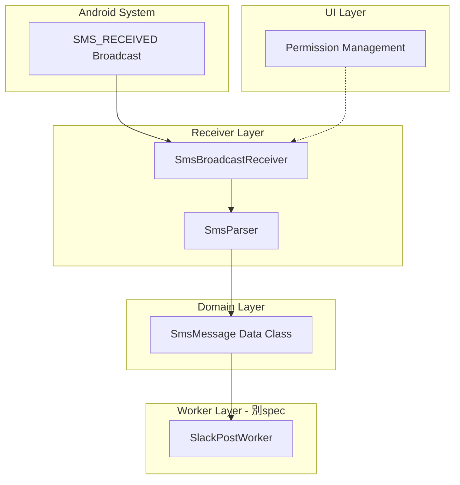
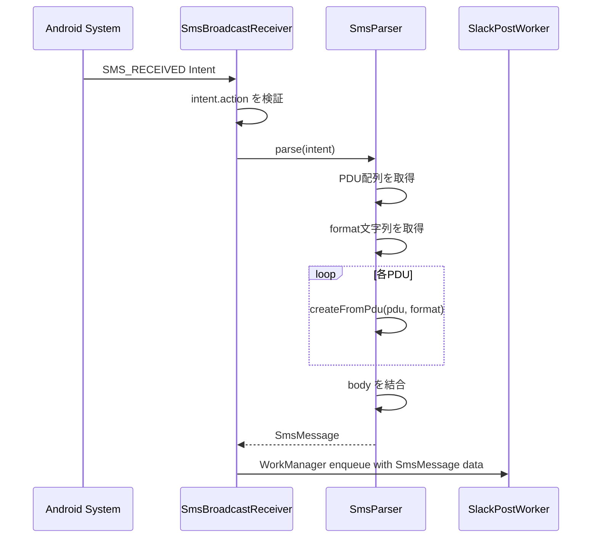
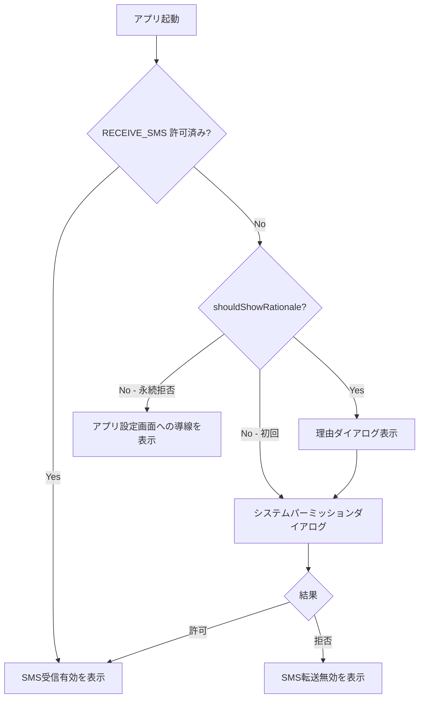
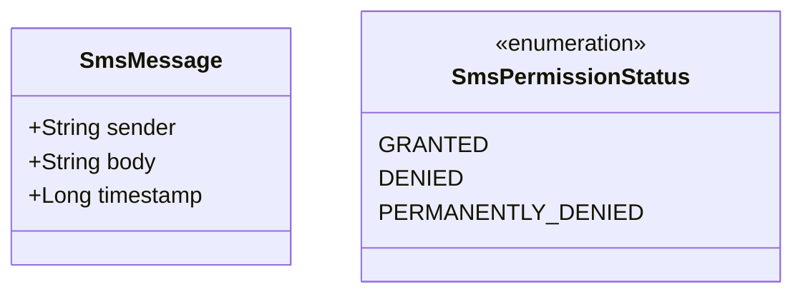

# Design Document: sms-reception

## Overview
**Purpose**: 本機能は、Android端末で受信したSMSメッセージをバックグラウンドで自動検知し、送信元番号・本文・タイムスタンプを抽出してアプリ内の後続処理に渡すための基盤を提供する。

**Users**: アプリの全ユーザーがこの機能を利用する。SMS転送パイプライン全体の入口として機能し、Slack投稿・フィルタリング・履歴管理はすべてこの機能に依存する。

### Goals
- SMS_RECEIVED ブロードキャストをバックグラウンドで確実に受信する
- マルチパートSMSを含むすべてのSMSメッセージを正確にパースする
- 型安全な SmsMessage ドメインモデルを通じて後続機能にデータを提供する
- ランタイムパーミッションを適切に管理し、ユーザーに明確なガイダンスを提供する

### Non-Goals
- Slackへの投稿処理（別 spec: slack-integration）
- SMSフィルタリングロジック（別 spec: sms-filtering）
- UI画面の詳細設計（別 spec: app-ui）
- SMS送信機能
- SMS受信履歴の永続化（転送履歴は slack-integration で管理）

## Architecture

### Architecture Pattern & Boundary Map



**Architecture Integration**:
- **Selected pattern**: レイヤードアーキテクチャ（receiver → domain → worker）。steering tech.md の MVVM + Repository パターンに準拠
- **Domain/feature boundaries**: receiver 層は Android インフラに依存し、domain 層は純粋 Kotlin。後続の worker 層への受け渡しは SmsMessage ドメインモデルを介する
- **Existing patterns preserved**: steering structure.md で定義されたパッケージ構成（receiver/, domain/model/）に従う
- **New components rationale**: SmsBroadcastReceiver（SMS検知のエントリポイント）、SmsParser（PDU解析の責務分離）、SmsMessage（型安全なデータ受け渡し）
- **Steering compliance**: domain 層の Android 非依存性、PascalCase 命名規則

### Technology Stack

| Layer | Choice / Version | Role in Feature | Notes |
|-------|------------------|-----------------|-------|
| Infrastructure | Android BroadcastReceiver | SMS_RECEIVED インテント受信 | マニフェスト静的登録 |
| Infrastructure | android.telephony.SmsMessage | PDU パース | API 23+ の createFromPdu(byte[], String) を使用 |
| Domain | Kotlin data class | SmsMessage ドメインモデル | Android 非依存 |
| UI | ActivityResultContracts | ランタイムパーミッション要求 | Jetpack Compose 統合 |

## System Flows

### SMS受信〜パースフロー



### パーミッション要求フロー



## Requirements Traceability

| Requirement | Summary | Components | Interfaces | Flows |
|-------------|---------|------------|------------|-------|
| 1.1 | SMS_RECEIVED受信で後続処理開始 | SmsBroadcastReceiver | onReceive | SMS受信フロー |
| 1.2 | バックグラウンドでSMS検知 | SmsBroadcastReceiver | マニフェスト登録 | SMS受信フロー |
| 1.3 | 端末再起動後も監視継続 | SmsBroadcastReceiver | マニフェスト静的登録 | — |
| 1.4 | アプリ非起動時も動作 | SmsBroadcastReceiver | マニフェスト静的登録 | — |
| 2.1 | PDUから送信元・本文・タイムスタンプ抽出 | SmsParser | parse() | SMS受信フロー |
| 2.2 | マルチパートSMS結合 | SmsParser | parse() | SMS受信フロー |
| 2.3 | パースエラー時の部分処理 | SmsParser | parse() | — |
| 2.4 | SmsMessage ドメインモデルを返す | SmsParser, SmsMessage | parse() | SMS受信フロー |
| 3.1 | sender, body, timestamp を含むデータクラス | SmsMessage | — | — |
| 3.2 | domain層配置、Android非依存 | SmsMessage | — | — |
| 4.1 | 初回起動時のパーミッション確認 | PermissionManager | checkPermission() | パーミッションフロー |
| 4.2 | 理由表示後にシステムダイアログ | PermissionManager | requestPermission() | パーミッションフロー |
| 4.3 | 許可時のUI反映 | PermissionManager | onPermissionResult | パーミッションフロー |
| 4.4 | 拒否時のガイダンス表示 | PermissionManager | onPermissionResult | パーミッションフロー |
| 4.5 | 永続拒否時の設定画面導線 | PermissionManager | openAppSettings() | パーミッションフロー |
| 5.1 | RECEIVE_SMS パーミッション宣言 | AndroidManifest | — | — |
| 5.2 | INTERNET パーミッション宣言 | AndroidManifest | — | — |
| 5.3 | SmsBroadcastReceiver 静的登録 | AndroidManifest | — | — |
| 5.4 | BROADCAST_SMS パーミッション属性 | AndroidManifest | — | — |

## Components and Interfaces

| Component | Domain/Layer | Intent | Req Coverage | Key Dependencies | Contracts |
|-----------|-------------|--------|--------------|-----------------|-----------|
| SmsBroadcastReceiver | Receiver | SMS_RECEIVED インテントを受信し後続処理を起動 | 1.1, 1.2, 1.3, 1.4 | SmsParser (P0), WorkManager (P0) | Event |
| SmsParser | Receiver | PDU配列を解析しSmsMessageを生成 | 2.1, 2.2, 2.3, 2.4 | SmsMessage (P0) | Service |
| SmsMessage | Domain | SMS情報の型安全なデータ構造 | 3.1, 3.2 | なし | State |
| PermissionManager | UI | ランタイムパーミッションの管理と要求 | 4.1, 4.2, 4.3, 4.4, 4.5 | ActivityResultContracts (P0) | State |
| AndroidManifest | Infrastructure | パーミッションとレシーバーの宣言 | 5.1, 5.2, 5.3, 5.4 | なし | — |

### Receiver Layer

#### SmsBroadcastReceiver

| Field | Detail |
|-------|--------|
| Intent | SMS_RECEIVED ブロードキャストを受信し、パース後に WorkManager へワークを委譲する |
| Requirements | 1.1, 1.2, 1.3, 1.4 |

**Responsibilities & Constraints**
- SMS_RECEIVED インテントのアクション検証
- SmsParser を呼び出して SmsMessage を取得
- WorkManager に SmsMessage データを渡してワークを enqueue する
- onReceive 内で長時間処理を行わない（10秒タイムアウト制限）

**Dependencies**
- Outbound: SmsParser — PDU解析 (P0)
- Outbound: WorkManager — 非同期ワーク委譲 (P0)
- External: Android System — SMS_RECEIVED ブロードキャスト (P0)

**Contracts**: Event [x]

##### Event Contract
- **Subscribed events**: `android.provider.Telephony.SMS_RECEIVED`
- **Published events**: WorkManager OneTimeWorkRequest（SmsMessage データを inputData として渡す）
- **Ordering / delivery guarantees**: システムブロードキャストの配信順序に依存。WorkManager が永続化と配信を保証

**Implementation Notes**
- マニフェストに `android:exported="true"` と `android:permission="android.permission.BROADCAST_SMS"` を設定
- `intent.action == Telephony.Sms.Intents.SMS_RECEIVED_ACTION` で検証
- WorkManager inputData には sender, body, timestamp を String/Long で渡す

#### SmsParser

| Field | Detail |
|-------|--------|
| Intent | SMS インテントから PDU を解析し SmsMessage ドメインモデルを生成する |
| Requirements | 2.1, 2.2, 2.3, 2.4 |

**Responsibilities & Constraints**
- Intent extras から PDU バイト配列と format 文字列を取得
- `SmsMessage.createFromPdu(pdu, format)` で個別メッセージを解析
- マルチパートSMSのbodyを結合
- パースエラーの個別ハンドリング（失敗PDUをスキップ）

**Dependencies**
- Inbound: SmsBroadcastReceiver — Intent 受け渡し (P0)
- Outbound: SmsMessage — ドメインモデル生成 (P0)
- External: android.telephony.SmsMessage — PDU解析API (P0)

**Contracts**: Service [x]

##### Service Interface
```kotlin
object SmsParser {
    fun parse(intent: Intent): SmsMessage?
}
```
- **Preconditions**: intent.action が SMS_RECEIVED_ACTION であること
- **Postconditions**: 成功時は SmsMessage を返す。全PDUのパースに失敗した場合は null を返す
- **Invariants**: 返される SmsMessage の sender は空文字列でない。body は少なくとも1つのPDUから取得された内容を含む

### Domain Layer

#### SmsMessage

| Field | Detail |
|-------|--------|
| Intent | 受信SMSの情報を表す型安全なドメインモデル |
| Requirements | 3.1, 3.2 |

**Responsibilities & Constraints**
- SMS情報の不変データ構造
- Android フレームワーク非依存（`android.*` import なし）
- domain/model/ パッケージに配置

**Dependencies**
- なし（他コンポーネントへの依存なし）

**Contracts**: State [x]

##### State Management
```kotlin
data class SmsMessage(
    val sender: String,
    val body: String,
    val timestamp: Long
)
```
- **Persistence & consistency**: 永続化は本 spec のスコープ外（WorkManager inputData として一時的に保持）
- **Concurrency strategy**: イミュータブル data class のため並行性の問題なし

### UI Layer

#### PermissionManager

| Field | Detail |
|-------|--------|
| Intent | RECEIVE_SMS ランタイムパーミッションの状態管理と要求フロー |
| Requirements | 4.1, 4.2, 4.3, 4.4, 4.5 |

**Responsibilities & Constraints**
- パーミッション状態の確認（granted / denied / permanently denied）
- 理由ダイアログの表示判定
- システムパーミッションダイアログの起動
- 永続拒否時のアプリ設定画面遷移
- Composable として実装（`rememberLauncherForActivityResult` 使用）

**Dependencies**
- External: ActivityResultContracts.RequestPermission — パーミッション要求 (P0)
- External: ContextCompat.checkSelfPermission — 状態確認 (P0)

**Contracts**: State [x]

##### State Management
```kotlin
enum class SmsPermissionStatus {
    GRANTED,
    DENIED,
    PERMANENTLY_DENIED
}
```
- **State model**: SmsPermissionStatus を StateFlow として公開
- **Persistence & consistency**: パーミッション状態は Android システムが管理。アプリは起動時に毎回確認する

**Implementation Notes**
- `rememberLauncherForActivityResult(ActivityResultContracts.RequestPermission())` でランチャーを取得
- `activity.shouldShowRequestPermissionRationale()` で理由表示を判定
- 永続拒否検出: パーミッション拒否後かつ `shouldShowRequestPermissionRationale()` が false の場合
- 設定画面遷移: `Intent(Settings.ACTION_APPLICATION_DETAILS_SETTINGS)` で端末アプリ設定を開く

## Data Models

### Domain Model



- **SmsMessage**: SMS受信データの値オブジェクト。イミュータブル。sender は電話番号文字列（国際表記含む）、body はメッセージ全文（マルチパート結合済み）、timestamp は UNIX epoch ミリ秒
- **SmsPermissionStatus**: パーミッション状態の列挙型

## Error Handling

### Error Strategy
SMS受信パイプラインの各段階で発生しうるエラーに対して、部分的な処理続行を優先する。

### Error Categories and Responses
- **PDU パースエラー**: 個別PDUのパース失敗 → エラーログ記録、成功したパートで続行。全PDU失敗 → null を返しワーク委譲をスキップ
- **Intent データ不正**: extras が null または pdus キーが存在しない → ログ記録して onReceive を即座に return
- **パーミッション未付与**: BroadcastReceiver はシステムから呼ばれるため影響なし。UI側でユーザーにガイダンス表示

### Monitoring
- `android.util.Log` を使用してパースエラーとレシーバー呼び出しをログ記録
- タグ: `SmsBroadcastReceiver`, `SmsParser`

## Testing Strategy

### Unit Tests
- `SmsParser.parse()`: 正常なシングルパートSMS、マルチパートSMS、不正PDU、空PDU配列のケース
- `SmsMessage`: data class の等値性・コピー動作
- `SmsPermissionStatus`: 列挙値の網羅

### Integration Tests
- `SmsBroadcastReceiver.onReceive()`: モック Intent を渡して SmsParser 呼び出しと WorkManager enqueue を検証
- パーミッション状態に応じた UI 状態変化

### E2E Tests
- Android Emulator の SMS 送信ツールで SMS 受信 → BroadcastReceiver 起動 → WorkManager ワーク enqueue を確認

## Security Considerations
- `android:permission="android.permission.BROADCAST_SMS"` でレシーバーをシステムブロードキャストに限定し、偽装インテントを防止
- 受信した SMS データはログに本文全文を記録しない（センシティブ情報の漏洩防止）
- パーミッション要求時に目的を明確に説明し、ユーザーの信頼を確保
